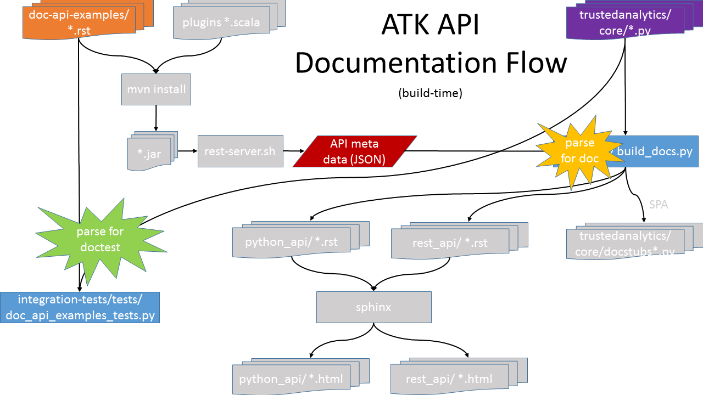

# Authoring Doc Examples for Test

 - Goal: keep doc examples up to date and working
 - Solution: execute doctest on examples as integration tests
 - What is doctest?  A python module which looks through text for what appears to be interactive python sessions and executes them.  Test results are based on comparing REPL output.  https://docs.python.org/2/library/doctest.html

### Example doctest input
```
This is an example of testing within documentation.
>>> 1 + 1
2

Incorrectly two numbers and verify
>>> 2 + 2
5

Multi-line input:
>>> len([1, 2, 3, 4, 5,
...      6, 7, 8, 9, 10])
10

Indeterminate output:  (-etc- is keyword to ignore output)
>>> import time
>>> time.time()
-etc-

Forget a blankline after expected output
>>> 3 + 3
6
This line of text comes too soon!

```

### Example doctest output
```
Trying:
    1 + 1
Expecting:
    2
ok
Trying:
    2 + 2
Expecting:
    5
**********************************************************************
File "/dev/atk/integration-tests/tests/doc_api_examples_test.py"
Failed example:
    2 + 2
Expected:
    5
Got:
    4
Trying:
    len([1, 2, 3, 4, 5,
         6, 7, 8, 9, 10])
Expecting:
    10
ok
Trying:
    import time
Expecting nothing
ok
Trying:
    time.time()
Expecting:
    -etc-
ok
Trying:
    3 + 3
Expecting:
    6
    This line of text comes too soon!
**********************************************************************
File "/dev/atk/integration-tests/tests/doc_api_examples_test.py"
Failed example:
    3 + 3
Expected:
    6
    This line of text comes too soon!
Got:
    6
**********************************************************************
1 items had failures:
   2 of   6 in doc_api_examples_test.py
6 tests in 1 items.
4 passed and 2 failed.
***Test Failed*** 2 failures.

Failure
Traceback (most recent call last):
  File "/dev/atk/integration-tests/tests/doc_api_examples_test.py", line 123, in test_doc_examples
    self.assertEqual(0, results.failed, "Tests in the example documentation failed.")
AssertionError: Tests in the example documentation failed.


Process finished with exit code 0
```

## Custom ATK doctest markup

### Why extra proprietary markup?
- Need to skip testing some examples
  - Some examples will not practically run in an integration test env
  - Need way to phase-in this testing
  - doctest has +SKIP markup, but it is per-line only and we don't want its ugliness in the documentation
    -  ```>>> frame.drop_columns('age')  # doctest: +SKIP```

- Need to hide test code (or any text) from doc
  - Some examples require setup code to run correctly which should not clutter the documentation

### Use simple, single-line markup  (HTMLish)

An ATK doc markup tag must take up an entire line and be preceded by only whitespace.  The markup tags have different effects depending on the target: *doctest* or *doc*.  The *doctest* target is when the examples are run for valdiation.  The *doc* target is when the examples are rendered for human consumption, like HTML.

- `<hide></hide>`  - hide text from doc
- `<skip></skip>` - skip tests in doctest
- `<progress>` - ignore output in doctest;  print approximate progress bar output in doc
- `<connect>` - ignore output in doctest; print approximate connection output in doc
- `<blankline>` - require a blankline in doctest output; print a blankline in doc

> Note: doctest provides an ELLIPSIS marker to ignore output which is valuable for indeterminate results, like the printing of a progress bar or a GUID, timestamp, etc.  The doctest default is the "..." string, but this is the same marker as line continuation in the REPL!  (major oversight by the doctest authors).  The workaround is to define your own, like "-etc-" or similar.  Since we bother to preprocess, we can make custom ellipsis markers that are friendlier to the documentation, hence `progress` and `connect`.  Btw, we do use `-etc-` as the doctest ELLIPSIS marker.

## Example

For this example to test, we need to import trustedanalytics and create a frame.  However, we don't want that to clutter the API documentation necessarily, so we surround it by `<hide></hide>`.  Notice the extra blank line after `-etc-` and before `</hide>` to close the doctest output eval.  Also, note the use of `<progress>` to correctly mark when a job occurs.

```
<hide>
>>> import trustedanalytics as ta
>>> ta.connect()
-etc-

>>> f = ta.Frame(ta.UploadRows([[1], [3], [1], [0], [2], [1], [4], [3]],
...                             [('numbers', ta.int32)]))
-etc-

</hide>
Consider the following sample data set containing several numbers.

>>> f.inspect()
[#]  numbers
============
[0]        1
[1]        3
[2]        1
[3]        0
[4]        2
[5]        1
[6]        4
[7]        3
>>> ecdf_frame = f.ecdf('numbers')
<progress>
>>> ecdf_frame.inspect()
[#]  numbers  numbers_ECDF
==========================
[0]        0         0.125
[1]        1           0.5
[2]        2         0.625
[3]        3         0.875
[4]        4           1.0
```

## doctest in ATK Overview

There are 2 source areas for the documentation examples:

1. The .rst files found recursively in `doc-api-examples/src/main/resources/python`

2. The specific API .py files in `python-client/trustedanalytics/core`

 


### Scripts

* `gen_doctests.sh` - script which call python script `tests/gendoct.py` to generate a test file for the doctests; called by `run_tests.sh` during full execution

* `tests/gendoct.py` - python script which collects the paths of all the files for doctest execution and creates a file in the `tests/` which contains the necessary testcases.  It also acts as a library module for this generated test file.

* `run_doctest.sh` - script which executes doctest on a single file; used for dev/debug; integration-tests rest-server must be running
